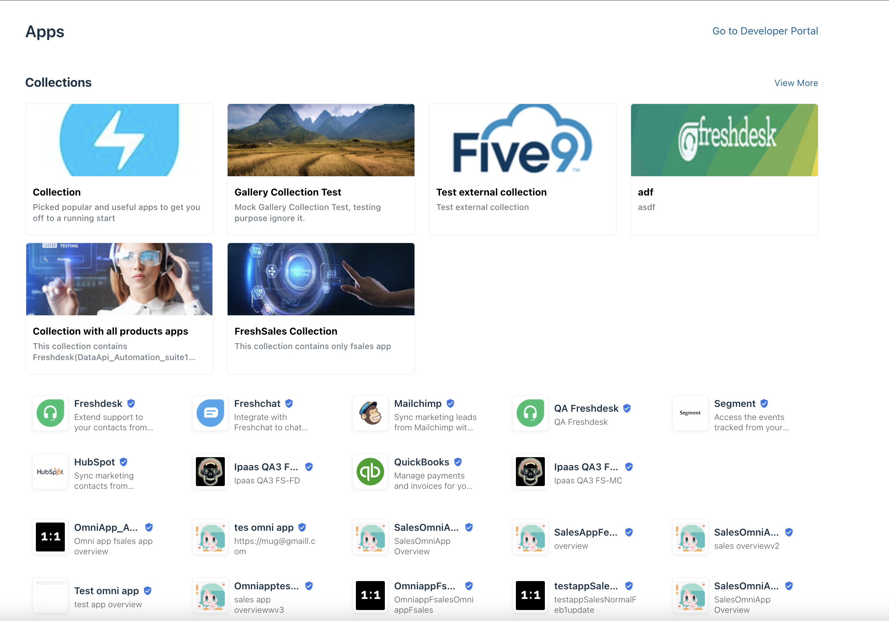

# gallery_frontend_v2_poc

* All components and views are using composition API's - script setup syntax 
* Pinia for state management 
* Using Crayons components
* Vite based setup 
* I18n integrated 
* Axios for API calls
* Gulp task for generating strings working good
* Typescript configured in composition API setup

## Screenshot 
<div style="display: flex">


</div>

## Recommended IDE Setup

[VSCode](https://code.visualstudio.com/) + [Volar](https://marketplace.visualstudio.com/items?itemName=johnsoncodehk.volar) (and disable Vetur) + [TypeScript Vue Plugin (Volar)](https://marketplace.visualstudio.com/items?itemName=johnsoncodehk.vscode-typescript-vue-plugin).

## Customize configuration

See [Vite Configuration Reference](https://vitejs.dev/config/).

## Project Setup

```sh
npm install
```

### Compile and Hot-Reload for Development

```sh
npm run dev
```

### Compile and Minify for Production

```sh
npm run build
```
